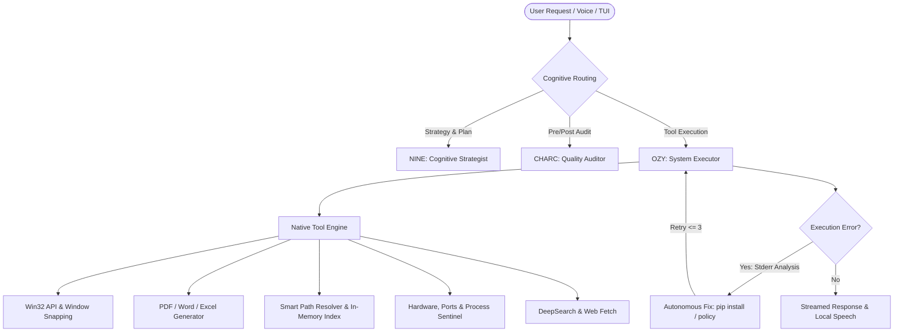

# OzyAssist

<div align="center">


[](https://golang.org)
[](https://microsoft.com)
[](#-zero-docker-pure-go-architecture)
[](https://modernc.org/sqlite)
[](https://github.com/charmbracelet/bubbletea)
[](LICENSE)

**An ultra-fast, autonomous desktop, coding, and cowork AI agent built natively for Windows.**  
Inspired by *Claude Desktop*, *Manus*, and *Claude Code*, engineered with a high-performance Go core, pure-Go SQLite persistence, in-memory project indexing, a self-healing terminal loop, and a multi-provider cognitive architecture.

[Key Capabilities](#-key-capabilities) •
[Cognitive Architecture](#-cognitive-architecture--the-triad) •
[User Interfaces](#-user-interfaces) •
[Tools Catalog](#-comprehensive-tool-catalog) •
[LLM Ecosystem](#-supported-llm-providers) •
[Installation & Usage](#-getting-started) •
[Commands & Shortcuts](#-tui-commands--shortcuts)

</div>

---

## 🌟 Overview

**OzyAssist** transforms your Windows environment into an intelligent, highly autonomous workstation. Operating under a strict **Zero-Docker** philosophy, OzyAssist runs directly on the host without container bloat or heavy virtualization overhead. It executes shell commands, manages open windows, edits codebases with surgical diffs, synthesizes professional Word/Excel/PDF documents, audits system hardware, and engages through a reactive terminal user interface (TUI) or an ultra-low latency streaming voice engine with wake-word activation.

### Why OzyAssist?

- **True Native Windows Integration**: Communicates directly with Win32 APIs, WMI/CIM, WASAPI CoreAudio, WinRT notifications, and the Windows Registry without third-party binary dependencies.
- **Zero-Docker Policy**: 100% pure-Go SQLite (`modernc.org/sqlite` with `CGO_ENABLED=0`), in-memory hybrid KV caching, and local vector search.
- **Self-Healing Loop**: Automatically diagnoses CLI execution failures (e.g., missing Python dependencies, syntax errors, or execution policies), silently applies fixes, and retries up to 3 times autonomously.
- **Cognitive Triad**: Separates execution, quality auditing, and high-level strategy across specialized cognitive personas under a unified LLM pipeline.
- **Continuous Memory & Profiling**: Automatically extracts user preferences, rules, and hardware topologies into an SQLite continuous memory bank (FTS5 BM25 + vector search) and updates a persistent user profile (`users.profile_md`).
- **Smart Path Resolver**: Resolves paths in microseconds via an in-memory inverted token map; never mistakenly redirects user workspace files into the server's working directory (`CWD`).

---

## ⚡ Key Capabilities



### 1. Intelligent ReAct Loop & Hallucination Suppression
- Step-by-step reasoning with collapsible thinking threads (`Ctrl+T` or `/thinking`).
- Rigid pre- and post-condition checks prevent false claims of application launch or window closure without verifying the underlying OS state.
- Modal dialog and error message inspection (`os_detect_dialogs`) checks for `#32770` modal popups and Win32 error dialogs immediately after running applications or scripts.

### 2. Autonomous Self-Healing Terminal Loop
- Intercepts `stderr` from PowerShell and CLI execution.
- Automatically diagnoses errors such as `ModuleNotFoundError: No module named '...'` or script policy restrictions.
- Silently executes remediation commands (`pip install <package>`, `npm install`, etc.) and retries the command autonomously up to 3 times without interrupting your flow.

### 3. Asynchronous Message Queuing & Interruption
- Continue typing while Ozy is executing tools or synthesizing complex tasks; your input is queued seamlessly (`[QUEUE: N]`).
- **Instant Override (`/now <command>`)**: Immediately interrupts active execution to prioritize the new prompt.
- **Smooth Cancellation (`Esc` or `/cancel`)**: Aborts running requests instantly without terminating the process; `/clearqueue` flushes pending prompts.

### 4. Smart Path Resolver & In-Memory Project Index
- High-speed Breadth-First Search (BFS, depth 3) indexes host drives (`C:`, `D:`) while skipping heavy directories (`node_modules`, `.git`, `venv`).
- Automatically detects project boundaries via marker files (`.git`, `go.mod`, `package.json`, `Cargo.toml`, `pyproject.toml`).
- An in-memory inverted token map resolves natural project names (e.g., `"crmgeofal"`) and common user folders (`Desktop`, `Documents`, `Downloads`) in microseconds without running heavy background database queries.

### 5. Native Office & Document Generation
- **Pure-Go Excel Engine (`os_create_excel`)**: Generates valid multi-sheet `.xlsx` workbooks with brand accent styling (`#D1F107`), auto-calculated columns, typed numeric formats, and formulas.
- **Pure-Go PDF Engine (`os_create_pdf`, `os_convert_to_pdf`)**: Generates executive PDFs (`github.com/jung-kurt/gofpdf`) with title banners, structured sections, bulleted callouts, and alternating-row tables.
- **Pure-Go Word Engine (`os_create_docx`)**: Emits valid Microsoft Word `.docx` documents via direct OpenXML ZIP packaging, supporting long-form reports (10–20+ pages) with page breaks, chapter styles, and tables.
- **Unified Document Reader (`os_read_document`)**: Extracts plain text from `.pdf`, `.docx`, `.xlsx`, `.csv`, `.txt`, `.json`, and `.log` files without third-party converters.

### 6. Desktop, Window & Hardware Automation
- **Graceful Window Management (`os_close_window`)**: Sends Win32 `WM_CLOSE` (0x0010) and `SC_CLOSE` messages to window handles (`HWND`) with automatic WMI/CIM fallback for elevated processes.
- **Dynamic Window Tiling (`os_tile_windows`)**: Snaps windows to `left`, `right`, `maximize`, `minimize`, `restore`, `center`, or `show_desktop` using `MoveWindow` and monitor work area geometry (`SPI_GETWORKAREA`).
- **Comprehensive Hardware Inspector (`os_hardware_inspector`)**:
  - **SMART Health Audit**: Proactively inspects physical disk health, thermal thresholds (>85°C), memory pressure, and Windows WHEA hardware architecture events.
  - **USB & Peripheral Audit**: Scans active USB ports, hubs, human interface devices, and storage drives.
  - **Webcam & Microphone Privacy Monitor**: Inspects Windows `CapabilityAccessManager\ConsentStore` to identify if the webcam or microphone is actively transmitting and which PID/app is capturing it.
  - **Hardware Telemetry**: Real-time CPU core loads, RAM allocation, volume storage breakdowns, NVIDIA/Intel GPU utilization and VRAM temperature (`nvidia-smi`), ACPI system thermals, and battery charge states.
- **Audio & WASAPI Volume Controller (`os_audio_device`)**: Reads master audio volume (0–100%), toggles mute states, and switches default audio endpoints via WASAPI CoreAudio interfaces (`IAudioEndpointVolume`).
- **Power Schemes & Brightness (`os_power_profile`)**: Queries and switches Windows power plans (`powercfg`) and adjusts display brightness percentages over WMI.

---

## 🧠 Cognitive Architecture — The Triad

OzyAssist orchestrates specialized cognitive personas under a unified LLM pipeline:

| Persona | Role | Primary Responsibility |
|---|---|---|
| ⚡ **OZY** | **Action Executor** | Directs system tools, manages Win32 processes, executes filesystem edits, dispatches MCP tools, and runs CLI commands. |
| 🛡️ **CHARC** | **Quality Auditor** | Enforces anti-hallucination protocols. Validates preconditions, inspects tool outputs, audits modal dialogs, and prevents premature task confirmations. |
| 🧠 **NINE** | **Strategic Planner** | Decomposes complex, ambiguous developer problems into structured milestones and synthesizes final insights. |
| 🌙 **DREAMER** | **Memory Consolidator** | Asynchronous background subagent that consolidates continuous session memories, deduplicates facts, and refines the persistent user profile (`users.profile_md`). |

---

## 🖥️ User Interfaces

### 1. Retro-Modern Bubble Tea TUI (`cmd/ozy`)
- **Retro BIOS Start Menu (80s–90s)**: Navigable with arrow keys (`↑`/`↓`/`Enter`) and native mouse cell clicks:
  1. `Start Conversation` (modern agentic chat)
  2. `Chat History` (fuzzy-searchable SQLite chat sessions with resume and `d` delete)
  3. `Settings & Diagnostics` (BIOS hardware telemetry, providers, and environment)
  4. `Live Voice Mode` (activates microphone and real-time spectrum)
  5. `Exit`
  - Direct hotkeys: `1`–`5`, or press `v` to enter Voice Mode instantly.
- **Clean Agentic Chat**:
  - Clean session header: `#shortID · <Topic>`.
  - High-contrast visual hierarchy: User prompts in neutral gray `#888888`, Agent responses with `O Ozy:` header in vibrant Electric Neon Lime `#d1f107`.
  - Non-redundant status bar and an input prompt badge `[OZY]`.
- **Collapsible Interactive Context Sidebar (`Ctrl+B` or `/context`)**:
  - Live token telemetry vs model context window limit with a visual progress gauge.
  - Pure-Go runtime memory stats (`runtime.MemStats`: Alloc, Sys, HeapAlloc, NumGC).
  - RAM-cached project count and active SQLite memory count.
- **Interactive Visual Memory Manager (`/memmgr`, `/memories gui`)**:
  - Browse, inspect, and delete individual persisted facts stored in SQLite.
- **Collapsible Thinking Playground (`Ctrl+T` or `/thinking`)**:
  - Toggles the visibility of inner reasoning tokens (`showThinking: false` by default).

### 2. Streaming Real-Time Voice Engine ("Hey Ozy")
- **Instant Launch**: Run `cmd/ozy voice` from the terminal or press **`Ctrl+V`** / type `/voice` inside an active TUI chat.
- **Continuous Wake-Word Detection**: Listens passively in the background for *"Hey Ozy"*.
- **Sentence-Chunked Streaming TTS (`SentenceStreamer`, `LocalSpeakerQueue`)**:
  - Evaluates token streams in real-time and breaks them at natural clause boundaries (`. `, `? `, `! `, `\n\n`, or `, ` > 100 characters).
  - Emits local spoken audio in ~300–400ms TTFT (Time-To-First-Token) without waiting for the full response to generate.
  - Spoken text normalizer (`CleanForSpeech`) removes Markdown asterisks, code blocks, bullet points, and raw URLs for fluent pronunciation.
- **Dual Synthesis Engines**:
  - Local Piper neural TTS engine.
  - Built-in Windows SAPI fallback (`Microsoft Helena Desktop (es-ES)` or system default).
- **Full Barge-in & Live Spectrum**:
  - Animated audio wave visualizer: `[LISTENING]` / `[OZY SPEAKING]`.
  - Speaking is interrupted immediately if the user speaks or presses `Esc`.

### 3. Web Server & WebSocket Streaming (`cmd/server`)
- Runs a Gin HTTP and WebSocket gateway at `http://localhost:8080/ws/chat`.
- Powers the modern React / TypeScript / Tailwind CSS web frontend and Tauri desktop application.

---

## 🛠️ Comprehensive Tool Catalog

OzyAssist provides an extensive suite of built-in native tools categorized by operational domain:

### 🪟 Desktop & Window Management
| Tool | Description |
|---|---|
| `os_get_desktop` | Lists all files, shortcuts, and items on the Windows Desktop in <1ms. |
| `os_list_apps` | Queries the Windows Registry to discover installed software and games. |
| `os_active_windows` | Lists all currently visible windows, window handles (`HWND`), titles, and process IDs. |
| `os_focus_window` | Brings a window to the foreground and focuses it by its `HWND`. |
| `os_close_window` | Gracefully closes a window via Win32 `WM_CLOSE`/`SC_CLOSE` with WMI elevated fallback. |
| `os_tile_windows` | Repositions or divides windows (`left`, `right`, `maximize`, `minimize`, `restore`, `center`, `show_desktop`). |
| `os_launch_app` | Launches any installed application with optional target files or project arguments. |
| `os_kill_process` | Terminates a process by name or PID with forced execution fallback. |
| `os_take_screenshot` | Captures a high-resolution PNG screenshot of the primary display. |
| `os_mouse_click` | Dispatches native cursor movements and clicks (`left`, `right`, `double`). |
| `os_type_text` | Simulates keyboard keystrokes and typing into the currently focused field. |
| `os_analyze_screen` | Captures the screen and executes multimodal visual reasoning on active UI elements. |
| `os_detect_dialogs` | Inspects `#32770` modal dialogs, error alerts, and message boxes to capture error text and buttons. |

### 📁 Filesystem & Workspace
| Tool | Description |
|---|---|
| `read_file` / `write_file` | Reads or writes workspace files with full UTF-8 character preservation. |
| `apply_diff` | Applies unified diff patches (`--- a/ +++ b/ @@`) for targeted edits without rewriting entire files. |
| `list_files` / `search_text` | Glob-based file listing and ultra-fast in-project text/regex search. |
| `os_explore` / `os_find_files` | Explores system folders with structured metadata and fast glob matching. |
| `os_create_dir` / `os_move_item` | Creates folder hierarchies or renames/moves files across the filesystem. |
| `os_copy_item` / `os_delete_item` | Copies items or safely deletes files (Windows Recycle Bin by default, or permanent). |
| `os_organize_folder` | Categorizes and groups cluttered folders into structured subfolders (Documents, Media, Code, etc.). |
| `os_compress_zip` / `os_extract_zip` | Native recursive ZIP compression and extraction with strict Zip Slip protection. |
| `os_search_content` | Native grep engine searching file contents across directories, skipping bulky folders. |
| `os_smart_organizer` | Detects duplicate files via cryptographic SHA-256 hashes and finds obsolete installers (`.exe`, `.msi`, `.iso`). |
| `os_file_info` | Retrieves creation timestamps, last-modified dates, and Windows file attributes. |

### 📄 Office, Documents & Database
| Tool | Description |
|---|---|
| `os_create_excel` | Builds professional `.xlsx` spreadsheets with Neon Lime headers (`#D1F107`), formulas, and typed cells. |
| `os_create_pdf` | Generates structured PDF reports with brand accent bars, sections, bullet points, and tables. |
| `os_convert_to_pdf` | Converts `.txt`, `.md`, `.csv`, or `.json` files into styled executive PDF documents. |
| `os_create_docx` | Compiles editable Microsoft Word `.docx` documents (10–20+ pages) via native OpenXML ZIP packaging. |
| `os_read_document` | Extracts structured text from `.pdf`, `.docx`, `.xlsx`, `.csv`, `.txt`, `.md`, and `.log` files. |
| `os_query_db` | Executes strict read-only SQL queries (`SELECT`, `PRAGMA`) on local SQLite databases (`?mode=ro`). |

### ⚙️ Hardware, Sentinel & System Control
| Tool | Description |
|---|---|
| `os_hardware_inspector` | Comprehensive hardware audit: SMART disk health, USB devices, webcam/mic in use, CPU/RAM/GPU telemetry. |
| `os_port_inspector` | Inspects TCP network listening sockets, associates PIDs and processes, and frees locked ports (`kill: true`). |
| `os_service_manager` | Queries, starts, stops, and restarts native Windows background services. |
| `os_docker_manager` | Inspects and controls the local Docker daemon and host containers (logs, stats, start, stop). |
| `os_analyze_logs` | Extracts stack traces and exceptions from local logs or the Windows Event Log (`Get-WinEvent`). |
| `os_disk_cleaner` | Safely analyzes and purges orphaned `%TEMP%` files and empties the Recycle Bin. |
| `os_audio_device` | Inspects and sets master volume (0–100%), toggles mute, and switches default audio endpoints. |
| `os_power_profile` | Inspects/sets Windows power schemes (Balanced, High Performance) and adjusts screen brightness. |
| `os_process_sentinel` | Lists top memory- or CPU-consuming processes and terminates hung or orphaned processes. |
| `os_watchdog` | Background monitor that tracks TCP ports or processes and sends Windows notifications on outages. |

### 🌐 Web, Networking & Communications
| Tool | Description |
|---|---|
| `web_search` | Real-time web search for up-to-date technical documentation, packages, and news. |
| `deep_search` | Multi-query in-depth web investigation synthesizing sources and providing citations. |
| `web_fetch` | Fetches any HTTP/HTTPS URL and converts live HTML to clean, readable Markdown. |
| `web_dns_lookup` | Resolves DNS records (`A`, `AAAA`, `CNAME`, `MX`, `TXT`) to verify domain infrastructure. |
| `os_download_file` | Downloads files, images, or installers directly to local user folders. |
| `os_network_diagnostics` | Tests ICMP ping latency, reports local network adapter IPs, and flushes Windows DNS cache. |
| `os_wifi_manager` | Reports wireless link telemetry (SSID, signal strength %, channel, PHY rate) and scans nearby networks. |
| `browser_list_profiles` | Discovers Chrome, Edge, and Brave browser profiles for authenticated browsing sessions. |
| `os_draft_email` | Drafts emails and opens the composition window in default desktop clients, Gmail, or Outlook Web. |
| `os_draft_whatsapp` | Pre-populates a WhatsApp conversation with a recipient and message ready for single-click sending. |
| `os_draft_telegram` | Opens Telegram Desktop or Web with the recipient and text pre-filled. |
| `telegram_send_message` | Sends headless Telegram messages in the background using the official Telegram Bot API. |

### 🧠 Continuous Memory & Profiling
| Tool | Description |
|---|---|
| `remember_fact` | Saves persistent facts, rules, user preferences, and tech stacks into SQLite memory. |
| `search_memory` | Performs hybrid FTS5 BM25 and semantic vector search across stored memory entries. |
| `update_user_profile` | Updates or expands the persistent user profile dossier (`users.profile_md`). |

### 🔔 System Utilities
| Tool | Description |
|---|---|
| `os_toast_notify` | Emits interactive native Windows 10/11 Toast banners in the Action Center. |
| `os_schedule_alarm` | Schedules alarms and timed reminders (`10m`, `1h`, `15:30`) with audible and notification alerts. |
| `os_schedule_task` | Creates, lists, or deletes persistent background tasks via `schtasks.exe`. |
| `os_keyboard_layout` | Queries and switches the active keyboard input language (`latam`, `spain`, `us`, KLID hex). |
| `os_startup_manager` | Audits and manages startup programs registered in `HKCU\Run`, `HKLM\Run`, and the Startup folder. |
| `os_notification_focus` | Toggles Windows Focus Assist / Quiet Hours to silence popups during deep work. |
| `os_get_clipboard` / `os_set_clipboard` | Reads or writes text directly from/to the Windows system clipboard. |
| `os_media_control` | Controls global multimedia playback (Play/Pause, Next, Previous, Stop) for Spotify, YouTube, and media players. |
| `os_display_config` | Queries connected displays and switches projection modes (`extend`, `clone`, `internal`, `external`). |
| `os_speak_text` | Synthesizes local real-time speech via Windows SAPI. |

---

## 🤖 Supported LLM Providers

OzyAssist supports hot-swapping providers and API keys at runtime without restarting the application:

| Provider | Configuration Command | Default Model | Notes |
|---|---|---|---|
| **Mistral AI** | `/key mistral <api-key>` | `mistral-large-latest` | High-speed OpenAI-compatible endpoint. Supports `codestral-latest` and `open-mixtral-8x22b`. |
| **KiloCode Gateway** | `/key kilocode <jwt-token>` | `kilo/anthropic/claude-sonnet-4-5` | Unified gateway providing access to +500 models (Claude 3.5/3.7, GPT-4o, Gemini 2.5 Pro). |
| **Cohere** | `/key cohere <api-key>` | `command-r-plus-08-2024` | Excellent for agentic reasoning, multilingual tasks, and structured tool calling. |
| **Groq** | `/key groq <api-key>` | `llama-3.3-70b-versatile` | Ultra-fast inference (~800 tok/s). Automatically enables the Groq Whisper STT voice engine. |
| **OpenAI** | `/key openai <api-key>` | `gpt-4o` | Official OpenAI API supporting `gpt-4o`, `o1`, `o3-mini`, and Whisper STT. |
| **OpenRouter** | `/key openrouter <api-key>` | `deepseek/deepseek-chat` | Aggregator providing access to hundreds of cloud models. |
| **Anthropic** | `/key anthropic <api-key>` | `claude-3-5-sonnet-20241022` | Official Anthropic API for Claude Sonnet, Opus, and Haiku models. |
| **DeepSeek** | `/key deepseek <api-key>` | `deepseek-chat` | Cost-effective, high-reasoning models (`deepseek-chat`, `deepseek-reasoner`). |
| **Local (Ollama / LM Studio)** | `/key local <url>` | `local-model` | 100% private local inference (`http://localhost:1234/v1` or `http://localhost:11434/v1`). |

---

## 📁 Project Structure

```
Ozyasist/
├── .agents/skills/             # Modular skill cheatsheets and capabilities (.md)
├── backend/                    # High-performance Go core
│   ├── cmd/
│   │   ├── ozy/                # Interactive Bubble Tea TUI entrypoint
│   │   ├── server/             # REST API & WebSocket streaming server
│   │   └── ozyctl/             # Administrative CLI & utility runner
│   ├── internal/
│   │   ├── agent/              # ReAct loop, Cognitive Triad, tool executors, self-healing
│   │   ├── api/                # HTTP routes, WebSocket handlers, streaming logic
│   │   ├── audio/              # Wake-word detection and microphone capture
│   │   ├── browser/            # Chrome DevTools / browser automation
│   │   ├── db/                 # Pure-Go SQLite driver, migrations, and entities
│   │   ├── mcp/                # Model Context Protocol (MCP) client (stdio/JSON-RPC)
│   │   ├── memory/             # Hybrid memory (SQLite FTS5 + RAM KV store)
│   │   ├── providers/          # Multi-LLM provider connectors
│   │   ├── search/             # DeepSearch multi-engine web search
│   │   ├── security/           # Multi-profile authentication and PIN protection
│   │   ├── system/             # Win32 APIs, Smart Path Resolver, hardware controls
│   │   ├── tui/                # Bubble Tea views, context sidebar, queues, retro menu
│   │   └── voice/              # Sentence-chunked streaming speech and local queue
│   └── go.mod
├── frontend/                   # React, TypeScript, Tailwind CSS, and Tauri UI
├── docs/                       # Architectural blueprints and engineering guides
├── training/                   # Local dataset pipelines and fine-tuning scripts
├── AGENTS.md                   # Operational guidelines and agentic rules
└── README.md                   # Primary documentation
```

---

## 🚀 Getting Started

### Prerequisites
- **Operating System**: Windows 10 or Windows 11 (x64)
- **Go**: Version `1.22` or newer (pure Go compilation; no CGO, GCC, or Docker required)
- **PowerShell**: 5.1+ (included natively with Windows)

### 1. Launch the Interactive TUI
```powershell
# Navigate to the backend directory
cd backend

# Run directly
go run cmd/ozy/main.go

# Or compile an optimized native binary:
go build -o ozy.exe ./cmd/ozy/.
.\ozy.exe
```

### 2. Launch Directly into Voice Mode
```powershell
cd backend
go run cmd/ozy/main.go voice
# Or with the compiled binary:
.\ozy.exe voice
```

### 3. Launch the Web & WebSocket Backend Server
```powershell
cd backend
go run cmd/server/main.go
```
*The server will start on `http://localhost:8080`, exposing WebSocket streaming at `/ws/chat`.*

---

## ⌨️ TUI Commands & Shortcuts

### Navigation & Core Controls
| Key / Command | Action |
|---|---|
| `Enter` | Submit prompt (or enqueue if the agent is actively executing). |
| `Esc` or `/cancel` | Cancel the running task immediately without terminating the process. |
| `/cancel all` | Abort active execution and clear all enqueued prompts. |
| `/now <order>` | Interrupt the active task and execute the new command immediately. |
| `/queue` or `/cola` | Display the list of enqueued messages. |
| `/clearqueue` | Flush the message queue. |
| `Ctrl + V` or `/voice` | Toggle Live Voice Mode (microphone listening & waveform). |
| `Ctrl + B` or `/context` | Toggle the Collapsible Interactive Context Sidebar. |
| `Ctrl + T` or `/thinking`| Toggle visibility of the inner reasoning (*Thinking*) process. |
| `Ctrl + L` or `/clear` | Clear the chat screen viewport. |
| `Ctrl + C` | Cancel current task, or exit if idle. |

### Memory & Session Management
| Command | Action |
|---|---|
| `/new` | Start a fresh chat session (automatically cleans empty sessions in SQLite). |
| `/history` | Open the interactive chat history browser with fuzzy search. |
| `/profile` | Display the persistent user profile (`users.profile_md`). |
| `/memories` | Display active memories and rules stored in SQLite. |
| `/memmgr` / `/memories gui` | Open the interactive Visual Memory Manager to inspect/delete facts. |
| `/remember <fact>` | Manually persist a fact or rule into continuous memory. |
| `/forget <id>` | Remove a memory entry by ID. |
| `/forgetall` | Clear all persisted user memories. |
| `/dream` | Trigger an asynchronous memory consolidation pass with the Dreamer subagent. |

### System & LLM Configuration
| Command | Action |
|---|---|
| `/provider [name]` | View or switch the active LLM provider. |
| `/model [name]` | Change the active model for the current provider. |
| `/key <provider> <key>` | Configure an API key or token on the fly (saved to `.env`). |
| `/tools` | List all registered tools (Native System Tools + dynamic MCP Tools). |
| `/mcp [reload]` | Inspect status or hot-reload connected MCP servers. |
| `/paths` | Display the detected project topology and drive roots indexed in RAM. |
| `/scan` | Trigger a fresh BFS scan of host drives to update the in-memory project index. |

---

## 🧪 Automated Test Suites

OzyAssist includes thorough unit and integration test suites:

```powershell
cd backend

# Test LLM providers (Mistral, KiloCode, Cohere, Groq, OpenAI, etc.)
go test ./internal/providers/... -v

# Test system utilities, Win32 wrappers, and Smart Path Resolver
go test ./internal/system/... -v

# Test agent loop, Cognitive Triad, and self-healing terminal
go test ./internal/agent/... -v

# Test TUI state machine and message queue
go test ./internal/tui/... -v

# Run the complete test suite across all packages
go test ./internal/...
```

---

## 🛡️ Zero-Docker Pure-Go Architecture

OzyAssist adheres strictly to a **Zero-Docker** architectural constraint:
- **No Containers**: Eliminates the overhead of Docker Desktop, WSL2 virtual machines, and background container daemons.
- **Pure-Go SQLite**: Built with `modernc.org/sqlite`, compiling cleanly without CGO (`CGO_ENABLED=0`) across any standard Go toolchain.
- **In-Memory Caching**: Low-latency `MemoryKVStore` with automatic TTL eviction, plus an optional pure-Go RESP Redis connector.
- **Native Document Generation**: Generates `.xlsx`, `.docx`, and `.pdf` files using pure-Go libraries without external converters or headless office installations.

---

## 📄 License

This project is licensed under the **MIT License**. See the [LICENSE](LICENSE) file for details.

<div align="center">
Built with precision for Windows power users and engineers.
</div>
