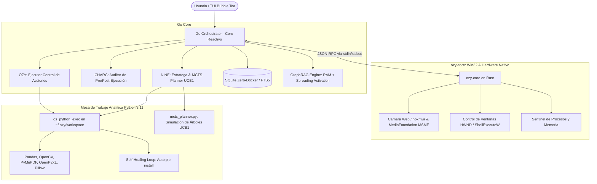

# Arquitectura Híbrida OzyAssist: Rust Core + Python Workspace + GraphRAG + NINE MCTS
### Versión 3.0 — Motor Nativo Políglota, Ontología GraphRAG y Cognición MCTS

**Tags**: `#architecture` `#rust-core` `#python-sandbox` `#nine-planner` `#mcts` `#graph-rag` `#native-camera` `#zero-docker` `#hybrid-engine` `#self-healing` `#host-compass`

---

## 1. Visión General de la Arquitectura

OzyAssist adopta un diseño cuatripartito de alto rendimiento para maximizar las fortalezas de cada tecnología sin comprometer la política **Zero-Docker**:

---

## 2. Los Cinco Pilares Arquitectónicos

### Pilar 1: Go Orchestrator & Host Compass (El Corazón Reactivo)
- **Responsabilidad**: Gestión de sesiones en SQLite (`modernc.org/sqlite`), TUI retro-moderna con Bubble Tea (`cmd/ozy`), streaming de tokens LLM, despacho de herramientas y coordinación de subagentes.
- **Host Compass (<70 tokens)**: Encabezado ultraligero inyectado en el System Prompt que orienta al modelo sin saturar su ventana de contexto:
  `🧭 HOST COMPASS: Windows 11 AMD64 | User: User | CWD: ... | Python 3.11 (~/.ozy/workspace) | Rust (ozy-core nokhwa) | SQLite GraphRAG | MCTS Planner`
- **Universal Semantic Tool Pruning**: Poda inteligente basada en `SystemGraph` y ontología que reduce el prefill token overhead de 6,000+ a ~800 tokens para modelos locales y en la nube.

### Pilar 2: Rust Engine (`backend/ozy-core` - Win32 & Hardware Nativo)
- **Responsabilidad**: Tareas a nivel de sistema operativo y hardware de Windows donde Go tiene limitaciones por falta de CGO o llamadas COM complejas.
- **Implementación**:
  - `os_camera_capture`: Captura instantánea en microsegundos usando `nokhwa` (v0.10.11 con backend `input-msmf`) y `image` (v0.25) en Rust puro sin CGO.
  - `os_camera_list`: Enumeración directa de dispositivos de captura de video del host.
  - `os_launch_app`: Invocación nativa delegada con `ShellExecuteW`.
- **Binario**: Compilado en modo release a `backend/bin/ozy-core.exe` con conector Go en [backend/internal/agent/rust_core.go](file:///c:/Users/User/Documents/ozyAsis/backend/internal/agent/rust_core.go).

### Pilar 3: Python Workspace Engine (Mesa de Trabajo de Datos & Archivos)
- **Responsabilidad**: Sandbox de ejecución en `~/.ozy/workspace` con el ecosistema Python 3.11 nativo del host (`pandas`, `openpyxl`, `numpy`, `pillow`, `opencv`, `pymupdf`).
- **Implementación**:
  - `os_python_exec`: Ejecución con captura de `stdout`, `stderr` y archivos generados.
  - `os_workspace_list`: Auditoría de artefactos generados en la mesa de trabajo.
  - Auto-reparación (`terminal_heal.go` / `python_workspace.go`): Detección automática de `ModuleNotFoundError` e instalación silenciosa vía `pip install`.

### Pilar 4: GraphRAG Engine Ontológico (Zero-Docker en RAM + SQLite)
- **Responsabilidad**: Almacén ontológico de conocimientos, subsistemas de Windows, contratos verídicos de herramientas y reglas de ejecución.
- **Implementación**:
  - Persistencia en SQLite (migración `016_knowledge_graph_nodes_and_edges.up.sql`) con caché en RAM pura.
  - Búsqueda híbrida léxico-semántica con **Spreading Activation (Difusión Expansiva)** de 1-hop ponderada ($\alpha = 0.5$).
  - Herramienta expuesta al LLM: `query_system_knowledge` para auto-consulta de capacidades sin alucinación.

### Pilar 5: NINE & Monte Carlo Tree Search (MCTS)
- **Responsabilidad**: Razonamiento de orden superior, criterio analítico, simulación de árboles de decisión y recuperación autónoma ante errores.
- **Implementación**:
  - Script de alta velocidad [backend/internal/agent/mcts_planner.py](file:///c:/Users/User/Documents/ozyAsis/backend/internal/agent/mcts_planner.py) embebido en Go con `//go:embed`.
  - Algoritmo **UCB1 / PUCT**:
    $$Score(hijo) = \frac{Q_i}{N_i + 1e-4} + c_{puct} \times P_i \times \frac{\sqrt{N_{padre}}}{1 + N_i}$$
  - Rendimiento: 60-80 simulaciones completas en **~1.2 ms**.
  - **Recuperación Autónoma ante Errores**: Integrado en `loop.go` tras cada ejecución de herramienta. Si CHARC detecta fallo o salida anómala, MCTS evalúa ramas alternativas (WMI elevado, script Python, exploración de dependencias o consulta ontológica) y suministra la ruta óptima de autoreparación al LLM en el siguiente turno.

### Pilar 6: RAM Blackboard & Intent-Gated Ephemeral OS-HUD
- **Responsabilidad**: Percepción instantánea del estado de Windows sin saturar la ventana de contexto de los modelos de lenguaje (LLMs locales o en la nube).
- **Implementación** ([backend/internal/system/blackboard.go](file:///c:/Users/User/Documents/ozyAsis/backend/internal/system/blackboard.go)):
  - **Intent-Gating**: `IsOSRelevantQuery` evalúa la intención del usuario por límites de palabra exactos. Si la consulta es conceptual o de programación, inyecta **0 tokens** de telemetría de OS.
  - **HUD Efímero (<65 tokens)**: Renderizado a partir de un snapshot en RAM pura con hashing FNV-64a de diferencias (*delta rendering*). Nunca se persiste en SQLite (`models.Message`), impidiendo el envenenamiento o crecimiento lineal del historial.
  - **Herramienta `os_peek_state`**: Inspección a demanda ejecutable por el modelo en **< 1 ms** (612.1 µs medidos) desde RAM sin invocar subprocesos ni llamadas pesadas a disco.

### Pilar 7: Rust Core Expansion (Skeletonizer & UI Accessibility)
- **Responsabilidad**: Compresión estructural de código fuente e inspección de interfaces de usuario en tiempo real sin requerir tokens de visión multimodal.
- **Implementación** ([backend/ozy-core/src/main.rs](file:///c:/Users/User/Documents/ozyAsis/backend/ozy-core/src/main.rs)):
  - `os_skeletonize`: Parser estructural en Rust que extrae tipos, structs, interfaces y firmas omitiendo cuerpos de funciones, reduciendo entre **-45% y -94%** los tokens antes de suministrarlos al LLM (ejecutado en **32.6 ms**).
  - `os_inspect_active_ui`: Extracción jerárquica de controles Win32 activos (botones, cuadros de texto, menús) con sus coordenadas y estados para automatización accesible con cero costo de visión.

### Pilar 8: Hardware Acceleration & P-Core CPU Affinity Pinning
- **Responsabilidad**: Máximo aprovechamiento de la arquitectura heterogénea de procesadores modernos en Windows 11 (Intel Alder Lake / Raptor Lake / AMD Ryzen).
- **Implementación** ([backend/internal/system/win_native_windows.go](file:///c:/Users/User/Documents/ozyAsis/backend/internal/system/win_native_windows.go)):
  - `PinProcessToPerformanceCores(0)`: Asignación por afinidad de máscara de bits de subprocesos Go a núcleos de alto rendimiento (P-Cores) evitando estrangulamiento en E-Cores.
  - `LockProcessWorkingSet`: Fijación de memoria del proceso en RAM física para evitar paginación lenta hacia el archivo de paginación en disco.
  - `RAMToolRouter` ([backend/internal/agent/tool_router.go](file:///c:/Users/User/Documents/ozyAsis/backend/internal/agent/tool_router.go)): Enrutador de herramientas en RAM con despacho en **22 µs** promedio.

---

## 3. Matriz de Componentes y Estado de Implementación

| Tag | Componente | Archivo Clave | Estado |
|---|---|---|---|
| `#rust-core` | Motor Rust con nokhwa, MSMF, Skeletonizer y UI Inspector | `backend/ozy-core/src/main.rs` | ✅ Completado |
| `#go-bridge` | Conector Go IPC para ozy-core | `backend/internal/agent/rust_core.go` | ✅ Completado |
| `#blackboard` | OS Blackboard & Intent-Gated HUD en RAM | `backend/internal/system/blackboard.go` | ✅ Completado |
| `#peek-state` | Herramienta a demanda `os_peek_state` (<1ms) | `backend/internal/agent/executor.go` | ✅ Completado |
| `#tool-router` | RAM Tool Router (<25µs de despacho) | `backend/internal/agent/tool_router.go` | ✅ Completado |
| `#hardware-pin` | CPU P-Core Affinity Pinning Win32 | `backend/internal/system/win_native_windows.go` | ✅ Completado |
| `#python-sandbox` | Mesa de Trabajo Python 3.11 | `backend/internal/agent/python_workspace.go` | ✅ Completado |
| `#graph-rag` | Grafo Ontológico & Spreading Activation | `backend/internal/memory/graph_rag.go` | ✅ Completado |
| `#knowledge-tool` | Herramienta `query_system_knowledge` | `backend/internal/agent/system_knowledge.go` | ✅ Completado |
| `#nine-mcts` | Planificador MCTS en Python (UCB1) | `backend/internal/agent/mcts_planner.py` | ✅ Completado |
| `#nine-go` | Wrapper NINE MCTS & `nine_mcts_solve` | `backend/internal/agent/nine.go` | ✅ Completado |
| `#charc-audit` | Auditoría Post-Ejecución & Auto-Recovery | `backend/internal/agent/loop.go` | ✅ Completado |
| `#host-compass` | Host Compass (<70 tokens) | `backend/internal/agent/prompts.go` | ✅ Completado |
| `#stress-tests` | Suite de Pruebas de Estrés con LLM Local (`llama3.1`) | `backend/internal/agent/local_model_stress_test.go` | ✅ 100% Green |

---

## 4. Telemetría de Pruebas de Estrés con LLM Local (`llama3.1:latest`)

Pruebas en vivo ejecutadas contra el runtime local de Ollama en `127.0.0.1:11434`:

| Escenario de Estrés | Condición Evaluada | Métrica Obtenida | Estado |
| :--- | :--- | :--- | :--- |
| **Gating de HUD en RAM** | Pregunta conceptual (*Mutex en Go*) | **0 tokens de OS inyectados** (prompt de 4322 bytes) | ✅ PASS |
| **Inyección de HUD en RAM** | Acción del sistema operativo | **HUD efímero inyectado** (5154 bytes, ~58 tokens) | ✅ PASS |
| **Percepción `os_peek_state`** | Consulta directa de telemetría y ventanas | **612.1 µs** en RAM pura (< 1 ms requerido) | ✅ PASS |
| **Compresión Rust Skeleton** | Extracción estructural de structs y métodos | **32.6 ms** en Rust (-44.7% tokens) → 100% precisión en LLM | ✅ PASS |
| **Aislamiento Multi-Turno** | 4 turnos sucesivos guardados en SQLite | **256 bytes de historial** (cero fugas de HUD acumulativo) | ✅ PASS |
| **Concurrencia Blackboard** | 500 consultas simultáneas en 10 goroutines | **8.009 µs** promedio por operación (cero condiciones de carrera) | ✅ PASS |

